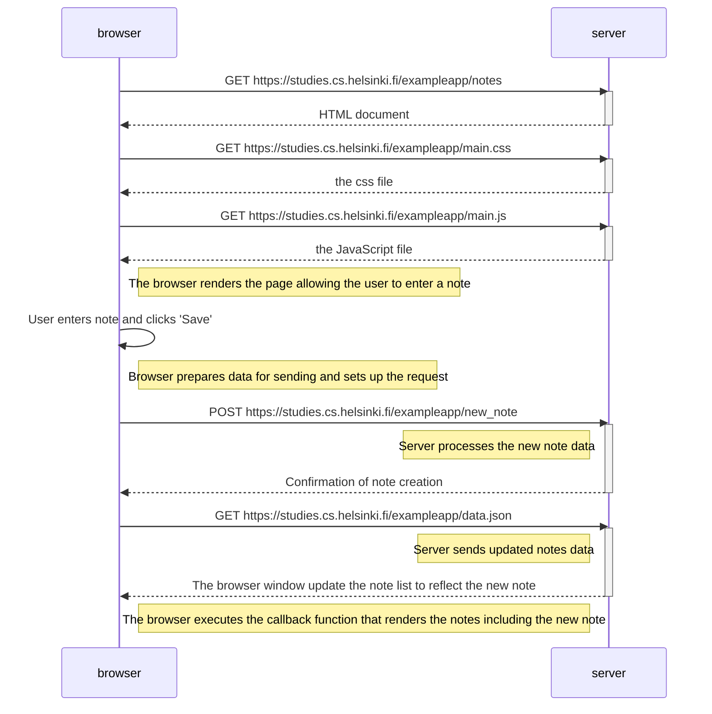

```mermaid
sequenceDiagram
    participant browser
    participant server

    browser->>server: GET https://studies.cs.helsinki.fi/exampleapp/notes
    activate server
    server-->>browser: HTML document
    deactivate server

    browser->>server: GET https://studies.cs.helsinki.fi/exampleapp/main.css
    activate server
    server-->>browser: the css file
    deactivate server

    browser->>server: GET https://studies.cs.helsinki.fi/exampleapp/main.js
    activate server
    server-->>browser: the JavaScript file
    deactivate server

    Note right of browser: The browser renders the page allowing the user to enter a note

    browser->>browser: User enters note and clicks 'Save'

    Note right of browser: Browser prepares data for sending and sets up the request

    browser->>server: POST https://studies.cs.helsinki.fi/exampleapp/new_note
    activate server
    Note left of server: Server processes the new note data
    server-->>browser: Confirmation of note creation
    deactivate server

    

    browser->>server: GET https://studies.cs.helsinki.fi/exampleapp/data.json
    activate server
    Note left of server: Server sends updated notes data
    server-->>browser: The browser window update the note list to reflect the new note
    deactivate server

    Note right of browser: The browser executes the callback function that renders the notes including the new note
```