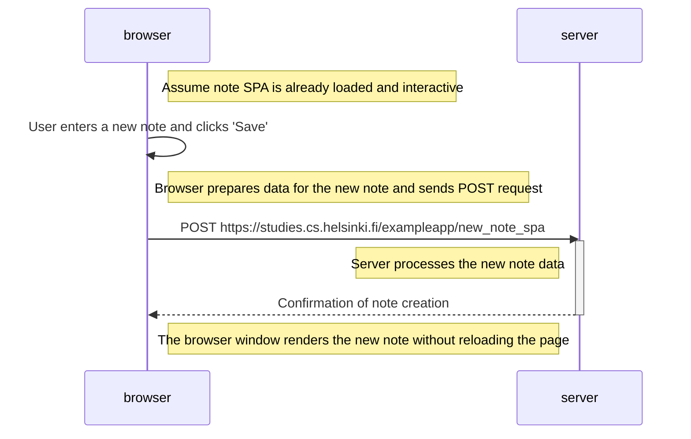

```mermaid
sequenceDiagram
    participant browser
    participant server

    Note right of browser: Assume note SPA is already loaded and interactive

    browser->>browser: User enters a new note and clicks 'Save'

    Note right of browser: Browser prepares data for the new note and sends POST request

    browser->>server: POST https://studies.cs.helsinki.fi/exampleapp/new_note_spa
    activate server
    Note left of server: Server processes the new note data
    server-->>browser: Confirmation of note creation
    deactivate server

    Note right of browser: The browser window renders the new note without reloading the page

```